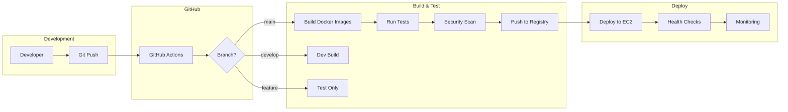

# CI/CD Pipeline Overview

## Introduction

The Prism DNS CI/CD pipeline provides automated build, test, and deployment capabilities for our managed DNS solution. This pipeline ensures consistent deployments, reduces manual errors, and enables rapid iteration.

## Pipeline Architecture



## Pipeline Stages

### 1. **Source Control Integration**
- Triggered on push to main, develop, or feature branches
- Pull request validation for all changes
- Branch protection rules enforced

### 2. **Build Stage**
- Docker multi-stage builds for optimization
- Dependency caching for faster builds
- Version tagging based on git commit

### 3. **Test Stage**
- Unit tests with coverage reporting
- Integration tests with test containers
- Security scanning with Trivy
- Code quality checks

### 4. **Package Stage**
- Docker image creation
- Image vulnerability scanning
- Push to GitHub Container Registry

### 5. **Deploy Stage**
- Environment-specific deployments
- Rolling updates with health checks
- Automatic rollback on failure

### 6. **Verify Stage**
- Smoke tests on deployed environment
- Performance baseline checks
- Alert configuration validation

## Workflow Triggers

| Trigger | Action | Environment | Approval Required |
|---------|--------|-------------|-------------------|
| Push to main | Full pipeline | Production | Yes (manual) |
| Push to develop | Full pipeline | Staging | No |
| Pull Request | Build & Test | None | No |
| Tag (v*) | Release | Production | Yes |
| Manual | Any stage | Selected | Depends |

## Environment Strategy

### Development
- **Purpose**: Rapid iteration and testing
- **Deployment**: Automatic on develop branch
- **Data**: Test data only
- **Access**: Development team

### Staging
- **Purpose**: Pre-production validation
- **Deployment**: Automatic on main branch
- **Data**: Production-like data
- **Access**: Extended team

### Production
- **Purpose**: Live service
- **Deployment**: Manual approval required
- **Data**: Production data
- **Access**: Restricted

## Security Measures

1. **Secret Management**
   - GitHub Secrets for sensitive data
   - Environment-specific configurations
   - Rotation policies enforced

2. **Access Control**
   - RBAC for deployment permissions
   - Audit logging for all actions
   - MFA required for production

3. **Vulnerability Scanning**
   - Container image scanning
   - Dependency vulnerability checks
   - SAST and DAST integration

## Monitoring and Alerts

### Pipeline Metrics
- Build duration trends
- Success/failure rates
- Deployment frequency
- Lead time for changes

### Notifications
- Slack integration for pipeline status
- Email alerts for failures
- PagerDuty for production issues

## Best Practices

1. **Commit Messages**
   ```
   feat: Add new DNS record type support
   fix: Resolve connection timeout issue
   docs: Update API documentation
   ```

2. **Branch Strategy**
   - `main`: Production-ready code
   - `develop`: Integration branch
   - `feature/*`: New features
   - `hotfix/*`: Emergency fixes

3. **Testing Requirements**
   - Minimum 80% code coverage
   - All tests must pass
   - No critical vulnerabilities

## Quick Start

### Running Pipeline Locally

```bash
# Install act for local GitHub Actions
brew install act

# Run pipeline locally
act -j build

# Run with secrets
act -j build --secret-file .env.secrets
```

### Manual Deployment

```bash
# Deploy to staging
./scripts/deploy.sh staging

# Deploy to production (requires approval)
./scripts/deploy.sh production --approve
```

## Troubleshooting

### Common Issues

1. **Build Failures**
   - Check Docker daemon status
   - Verify base image availability
   - Review build logs in Actions tab

2. **Test Failures**
   - Check test environment setup
   - Verify test data availability
   - Review test output logs

3. **Deployment Failures**
   - Verify AWS credentials
   - Check EC2 instance status
   - Review deployment logs

## Pipeline Configuration

Key configuration files:
- `.github/workflows/deploy-direct.yml`: Main pipeline
- `.github/workflows/test.yml`: Test workflow
- `docker-compose.yml`: Local development
- `scripts/deploy.sh`: Deployment script

## Performance Optimization

1. **Caching Strategy**
   - Docker layer caching
   - Dependency caching
   - Test result caching

2. **Parallel Execution**
   - Matrix builds for multiple versions
   - Parallel test execution
   - Concurrent deployments (non-prod)

## Rollback Procedures

### Automatic Rollback
- Triggered on health check failure
- Reverts to previous version
- Notifies team immediately

### Manual Rollback
```bash
# List recent deployments
./scripts/list-deployments.sh

# Rollback to specific version
./scripts/rollback.sh <version>
```

## Maintenance

### Regular Tasks
- Weekly dependency updates
- Monthly security patches
- Quarterly pipeline review

### Pipeline Updates
- Test in development first
- Gradual rollout approach
- Document all changes

## Contact and Support

- **Pipeline Issues**: #ci-cd-support channel
- **Emergency**: On-call engineer via PagerDuty
- **Documentation**: This guide and team wiki

---

*Last Updated: December 2024*
*Version: 1.0*