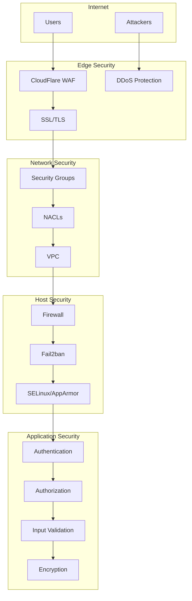

# Security Guide

## Overview

This guide covers security best practices, hardening procedures, and compliance requirements for the Prism DNS infrastructure.

## Security Architecture



## Network Security

### 1. AWS Security Groups

```terraform
# Minimal privilege security group
resource "aws_security_group" "prism_app" {
  name_prefix = "prism-app-"
  description = "Security group for Prism application"
  vpc_id      = var.vpc_id

  # SSH - Restricted to bastion
  ingress {
    from_port       = 22
    to_port         = 22
    protocol        = "tcp"
    security_groups = [aws_security_group.bastion.id]
    description     = "SSH from bastion only"
  }

  # HTTPS - Public
  ingress {
    from_port   = 443
    to_port     = 443
    protocol    = "tcp"
    cidr_blocks = ["0.0.0.0/0"]
    description = "HTTPS from anywhere"
  }

  # HTTP - Redirect only
  ingress {
    from_port   = 80
    to_port     = 80
    protocol    = "tcp"
    cidr_blocks = ["0.0.0.0/0"]
    description = "HTTP for redirect"
  }

  # Prism TCP - Public
  ingress {
    from_port   = 8080
    to_port     = 8080
    protocol    = "tcp"
    cidr_blocks = ["0.0.0.0/0"]
    description = "Prism TCP service"
  }

  # DNS - Public
  ingress {
    from_port   = 53
    to_port     = 53
    protocol    = "udp"
    cidr_blocks = ["0.0.0.0/0"]
    description = "DNS UDP"
  }

  ingress {
    from_port   = 53
    to_port     = 53
    protocol    = "tcp"
    cidr_blocks = ["0.0.0.0/0"]
    description = "DNS TCP"
  }

  # Deny all other inbound
  ingress {
    from_port   = 0
    to_port     = 0
    protocol    = "-1"
    self        = true
    description = "Allow from same SG only"
  }

  # Egress - Restricted
  egress {
    from_port   = 80
    to_port     = 80
    protocol    = "tcp"
    cidr_blocks = ["0.0.0.0/0"]
    description = "HTTP for updates"
  }

  egress {
    from_port   = 443
    to_port     = 443
    protocol    = "tcp"
    cidr_blocks = ["0.0.0.0/0"]
    description = "HTTPS for updates"
  }

  egress {
    from_port   = 53
    to_port     = 53
    protocol    = "udp"
    cidr_blocks = ["0.0.0.0/0"]
    description = "DNS resolution"
  }

  # Database access
  egress {
    from_port       = 5432
    to_port         = 5432
    protocol        = "tcp"
    security_groups = [aws_security_group.database.id]
    description     = "PostgreSQL access"
  }

  tags = {
    Name = "prism-app-sg"
  }
}
```

### 2. Firewall Configuration

```bash
#!/bin/bash
# configure-firewall.sh

# Enable UFW
ufw --force enable

# Default policies
ufw default deny incoming
ufw default allow outgoing
ufw default deny routed

# Allow SSH from specific IPs only
ufw allow from 10.0.0.0/8 to any port 22 comment "SSH from VPN"

# Web services
ufw allow 80/tcp comment "HTTP"
ufw allow 443/tcp comment "HTTPS"

# Prism services
ufw allow 8080/tcp comment "Prism TCP"
ufw allow 53/udp comment "DNS UDP"
ufw allow 53/tcp comment "DNS TCP"

# Rate limiting for DNS
ufw limit 53/udp comment "DNS rate limit"
ufw limit 53/tcp comment "DNS rate limit"

# Monitoring (internal only)
ufw allow from 172.20.0.0/24 to any port 9090 comment "Prometheus"
ufw allow from 172.20.0.0/24 to any port 3000 comment "Grafana"

# Enable logging
ufw logging medium

# Show status
ufw status verbose
```

### 3. DDoS Protection

```bash
# iptables DDoS protection rules
#!/bin/bash

# Connection tracking
iptables -A INPUT -m conntrack --ctstate ESTABLISHED,RELATED -j ACCEPT

# Drop invalid packets
iptables -A INPUT -m conntrack --ctstate INVALID -j DROP

# DNS rate limiting
iptables -A INPUT -p udp --dport 53 -m recent --set --name DNS --rsource
iptables -A INPUT -p udp --dport 53 -m recent --update --seconds 1 --hitcount 10 --name DNS --rsource -j DROP

# TCP SYN flood protection
iptables -N syn_flood
iptables -A INPUT -p tcp --syn -j syn_flood
iptables -A syn_flood -m limit --limit 10/s --limit-burst 20 -j RETURN
iptables -A syn_flood -j DROP

# ICMP flood protection
iptables -A INPUT -p icmp -m limit --limit 1/s --limit-burst 1 -j ACCEPT
iptables -A INPUT -p icmp -j DROP

# Port scan detection
iptables -N port_scan
iptables -A INPUT -p tcp --tcp-flags SYN,ACK,FIN,RST RST -m limit --limit 1/s -j port_scan
iptables -A port_scan -j DROP

# Save rules
iptables-save > /etc/iptables/rules.v4
```

## Host Security

### 1. SSH Hardening

```bash
# /etc/ssh/sshd_config
Port 22
Protocol 2
HostKey /etc/ssh/ssh_host_ed25519_key
HostKey /etc/ssh/ssh_host_rsa_key

# Logging
SyslogFacility AUTH
LogLevel VERBOSE

# Authentication
LoginGraceTime 30
PermitRootLogin no
StrictModes yes
MaxAuthTries 3
MaxSessions 10

# Key-based auth only
PubkeyAuthentication yes
PasswordAuthentication no
PermitEmptyPasswords no
ChallengeResponseAuthentication no

# Disable unnecessary features
X11Forwarding no
PrintMotd no
PrintLastLog yes
TCPKeepAlive yes
Compression delayed
UsePAM yes

# Restrict users
AllowUsers ubuntu prism
AllowGroups ssh-users

# Security
PermitUserEnvironment no
Ciphers chacha20-poly1305@openssh.com,aes256-gcm@openssh.com,aes128-gcm@openssh.com
MACs hmac-sha2-512-etm@openssh.com,hmac-sha2-256-etm@openssh.com
KexAlgorithms curve25519-sha256,curve25519-sha256@libssh.org

# Rate limiting
MaxStartups 10:30:60
ClientAliveInterval 300
ClientAliveCountMax 2
```

### 2. Fail2ban Configuration

```ini
# /etc/fail2ban/jail.local
[DEFAULT]
bantime = 3600
findtime = 600
maxretry = 5
destemail = security@example.com
sender = fail2ban@prism.example.com
action = %(action_mwl)s

[sshd]
enabled = true
port = 22
filter = sshd
logpath = /var/log/auth.log
maxretry = 3
bantime = 7200

[nginx-http-auth]
enabled = true
filter = nginx-http-auth
port = http,https
logpath = /var/log/nginx/error.log

[nginx-noscript]
enabled = true
port = http,https
filter = nginx-noscript
logpath = /var/log/nginx/access.log
maxretry = 6

[nginx-badbots]
enabled = true
port = http,https
filter = nginx-badbots
logpath = /var/log/nginx/access.log
maxretry = 2

[nginx-noproxy]
enabled = true
port = http,https
filter = nginx-noproxy
logpath = /var/log/nginx/access.log
maxretry = 2

[nginx-req-limit]
enabled = true
filter = nginx-req-limit
port = http,https
logpath = /var/log/nginx/error.log
maxretry = 10

# Custom DNS abuse filter
[dns-abuse]
enabled = true
filter = dns-abuse
port = 53
protocol = udp
logpath = /var/log/powerdns.log
maxretry = 100
findtime = 60
bantime = 3600
```

### 3. System Hardening

```bash
#!/bin/bash
# system-hardening.sh

# Kernel hardening
cat >> /etc/sysctl.d/99-security.conf << EOF
# IP Spoofing protection
net.ipv4.conf.all.rp_filter = 1
net.ipv4.conf.default.rp_filter = 1

# Ignore ICMP redirects
net.ipv4.conf.all.accept_redirects = 0
net.ipv6.conf.all.accept_redirects = 0

# Ignore send redirects
net.ipv4.conf.all.send_redirects = 0

# Disable source packet routing
net.ipv4.conf.all.accept_source_route = 0
net.ipv6.conf.all.accept_source_route = 0

# Log Martians
net.ipv4.conf.all.log_martians = 1

# Ignore ICMP ping requests
net.ipv4.icmp_echo_ignore_broadcasts = 1

# Ignore Directed pings
net.ipv4.icmp_ignore_bogus_error_responses = 1

# Enable TCP/IP SYN cookies
net.ipv4.tcp_syncookies = 1
net.ipv4.tcp_max_syn_backlog = 2048
net.ipv4.tcp_synack_retries = 2
net.ipv4.tcp_syn_retries = 5

# Disable IPv6 if not used
net.ipv6.conf.all.disable_ipv6 = 1
net.ipv6.conf.default.disable_ipv6 = 1
net.ipv6.conf.lo.disable_ipv6 = 1

# Increase system file descriptor limit
fs.file-max = 65535

# Enable ExecShield
kernel.randomize_va_space = 2

# Restrict core dumps
fs.suid_dumpable = 0
kernel.core_uses_pid = 1
EOF

sysctl -p /etc/sysctl.d/99-security.conf

# Secure shared memory
echo "tmpfs /run/shm tmpfs defaults,noexec,nosuid 0 0" >> /etc/fstab

# Disable unnecessary services
systemctl disable bluetooth.service
systemctl disable cups.service
systemctl disable avahi-daemon.service

# Set file permissions
chmod 644 /etc/passwd
chmod 644 /etc/group
chmod 600 /etc/shadow
chmod 600 /etc/gshadow
chmod 600 /etc/ssh/sshd_config

# Enable auditd
apt-get install -y auditd
systemctl enable auditd
systemctl start auditd

# Configure audit rules
cat >> /etc/audit/rules.d/audit.rules << EOF
# Monitor authentication
-w /etc/passwd -p wa -k passwd_changes
-w /etc/group -p wa -k group_changes
-w /etc/shadow -p wa -k shadow_changes
-w /etc/sudoers -p wa -k sudoers_changes

# Monitor SSH
-w /etc/ssh/sshd_config -p wa -k sshd_config

# Monitor system calls
-a exit,always -F arch=b64 -S execve -k exec
-a exit,always -F arch=b64 -S connect -k network
EOF

service auditd restart
```

## Application Security

### 1. Environment Variables

```bash
# .env.production (never commit!)
# Database
POSTGRES_PASSWORD=$(openssl rand -base64 32)
POSTGRES_ENCRYPTION_KEY=$(openssl rand -base64 32)

# Application
PRISM_SECRET_KEY=$(openssl rand -base64 64)
PRISM_JWT_SECRET=$(openssl rand -base64 32)
PRISM_API_KEY=$(openssl rand -base64 32)

# PowerDNS
PDNS_API_KEY=$(openssl rand -base64 32)

# Monitoring
GRAFANA_ADMIN_PASSWORD=$(openssl rand -base64 20)
PROMETHEUS_ADMIN_PASSWORD=$(openssl rand -base64 20)

# Encryption
ENCRYPT_SENSITIVE_DATA=true
USE_TLS_INTERNAL=true
```

### 2. Input Validation

```python
# server/security/validation.py
from typing import Any, Dict
import re
import ipaddress
from pydantic import BaseModel, validator

class HostnameValidator(BaseModel):
    hostname: str
    
    @validator('hostname')
    def validate_hostname(cls, v):
        # RFC 1123 hostname validation
        if not v or len(v) > 253:
            raise ValueError('Invalid hostname length')
        
        labels = v.split('.')
        for label in labels:
            if not label or len(label) > 63:
                raise ValueError('Invalid label length')
            
            if not re.match(r'^[a-z0-9]([a-z0-9\-]{0,61}[a-z0-9])?$', label, re.IGNORECASE):
                raise ValueError('Invalid hostname format')
        
        return v.lower()

class IPAddressValidator(BaseModel):
    ip: str
    
    @validator('ip')
    def validate_ip(cls, v):
        try:
            # Validate and normalize IP
            ip_obj = ipaddress.ip_address(v)
            
            # Reject private/reserved IPs for public services
            if ip_obj.is_private or ip_obj.is_reserved or ip_obj.is_loopback:
                raise ValueError('Invalid IP address type')
            
            return str(ip_obj)
        except ipaddress.AddressValueError:
            raise ValueError('Invalid IP address format')

# SQL injection prevention
def sanitize_query_param(param: str, param_type: str = 'string') -> Any:
    """Sanitize query parameters to prevent injection."""
    if param_type == 'string':
        # Remove dangerous characters
        sanitized = re.sub(r'[^\w\s\-\.]', '', param)
        return sanitized[:100]  # Limit length
    elif param_type == 'integer':
        try:
            return int(param)
        except ValueError:
            raise ValueError('Invalid integer parameter')
    elif param_type == 'boolean':
        return param.lower() in ['true', '1', 'yes', 'on']
```

### 3. Authentication & Authorization

```python
# server/security/auth.py
import jwt
import bcrypt
from datetime import datetime, timedelta
from functools import wraps

class AuthManager:
    def __init__(self, secret_key: str):
        self.secret_key = secret_key
        
    def hash_password(self, password: str) -> str:
        """Hash password with bcrypt."""
        salt = bcrypt.gensalt(rounds=12)
        return bcrypt.hashpw(password.encode('utf-8'), salt).decode('utf-8')
    
    def verify_password(self, password: str, hashed: str) -> bool:
        """Verify password against hash."""
        return bcrypt.checkpw(
            password.encode('utf-8'),
            hashed.encode('utf-8')
        )
    
    def generate_token(self, user_id: str, expires_in: int = 3600) -> str:
        """Generate JWT token."""
        payload = {
            'user_id': user_id,
            'exp': datetime.utcnow() + timedelta(seconds=expires_in),
            'iat': datetime.utcnow(),
            'jti': str(uuid.uuid4())  # Unique token ID
        }
        return jwt.encode(payload, self.secret_key, algorithm='HS256')
    
    def verify_token(self, token: str) -> Dict[str, Any]:
        """Verify and decode JWT token."""
        try:
            payload = jwt.decode(
                token,
                self.secret_key,
                algorithms=['HS256']
            )
            # Additional checks (e.g., blacklist, user status)
            return payload
        except jwt.ExpiredSignatureError:
            raise AuthError('Token expired')
        except jwt.InvalidTokenError:
            raise AuthError('Invalid token')

# Rate limiting decorator
def rate_limit(max_calls: int = 10, window: int = 60):
    def decorator(func):
        call_times = {}
        
        @wraps(func)
        async def wrapper(request, *args, **kwargs):
            client_ip = request.remote_addr
            current_time = time.time()
            
            # Clean old entries
            call_times[client_ip] = [
                t for t in call_times.get(client_ip, [])
                if current_time - t < window
            ]
            
            # Check rate limit
            if len(call_times.get(client_ip, [])) >= max_calls:
                raise RateLimitError('Rate limit exceeded')
            
            # Record call
            call_times.setdefault(client_ip, []).append(current_time)
            
            return await func(request, *args, **kwargs)
        
        return wrapper
    return decorator
```

## SSL/TLS Configuration

### 1. Nginx SSL Configuration

```nginx
# /etc/nginx/sites-available/prism-ssl
server {
    listen 443 ssl http2;
    listen [::]:443 ssl http2;
    server_name prism.thepaynes.ca;

    # SSL Certificate
    ssl_certificate /etc/letsencrypt/live/prism.thepaynes.ca/fullchain.pem;
    ssl_certificate_key /etc/letsencrypt/live/prism.thepaynes.ca/privkey.pem;
    ssl_trusted_certificate /etc/letsencrypt/live/prism.thepaynes.ca/chain.pem;

    # SSL Configuration
    ssl_protocols TLSv1.2 TLSv1.3;
    ssl_ciphers ECDHE-ECDSA-AES128-GCM-SHA256:ECDHE-RSA-AES128-GCM-SHA256:ECDHE-ECDSA-AES256-GCM-SHA384:ECDHE-RSA-AES256-GCM-SHA384:ECDHE-ECDSA-CHACHA20-POLY1305:ECDHE-RSA-CHACHA20-POLY1305:DHE-RSA-AES128-GCM-SHA256:DHE-RSA-AES256-GCM-SHA384;
    ssl_prefer_server_ciphers off;
    ssl_session_cache shared:SSL:10m;
    ssl_session_timeout 10m;
    ssl_session_tickets off;
    ssl_stapling on;
    ssl_stapling_verify on;

    # Security Headers
    add_header Strict-Transport-Security "max-age=63072000; includeSubDomains; preload" always;
    add_header X-Frame-Options "DENY" always;
    add_header X-Content-Type-Options "nosniff" always;
    add_header X-XSS-Protection "1; mode=block" always;
    add_header Referrer-Policy "no-referrer-when-downgrade" always;
    add_header Content-Security-Policy "default-src 'self' http: https: data: blob: 'unsafe-inline'" always;
    add_header Permissions-Policy "geolocation=(), microphone=(), camera=()" always;

    # Rate limiting
    limit_req_zone $binary_remote_addr zone=api:10m rate=10r/s;
    limit_req zone=api burst=20 nodelay;

    # Proxy settings
    location / {
        proxy_pass http://localhost:8090;
        proxy_set_header Host $host;
        proxy_set_header X-Real-IP $remote_addr;
        proxy_set_header X-Forwarded-For $proxy_add_x_forwarded_for;
        proxy_set_header X-Forwarded-Proto $scheme;
        
        # Security
        proxy_hide_header X-Powered-By;
        proxy_hide_header Server;
    }
}

# Redirect HTTP to HTTPS
server {
    listen 80;
    listen [::]:80;
    server_name prism.thepaynes.ca;
    return 301 https://$server_name$request_uri;
}
```

### 2. Certificate Management

```bash
#!/bin/bash
# cert-management.sh

# Install certbot
apt-get update
apt-get install -y certbot python3-certbot-nginx

# Obtain certificate
certbot certonly --nginx \
    -d prism.thepaynes.ca \
    -d www.prism.thepaynes.ca \
    --non-interactive \
    --agree-tos \
    --email admin@thepaynes.ca

# Auto-renewal
cat > /etc/systemd/system/certbot-renewal.service << EOF
[Unit]
Description=Certbot Renewal
After=network.target

[Service]
Type=oneshot
ExecStart=/usr/bin/certbot renew --quiet --deploy-hook "systemctl reload nginx"
EOF

cat > /etc/systemd/system/certbot-renewal.timer << EOF
[Unit]
Description=Run certbot twice daily

[Timer]
OnCalendar=*-*-* 00,12:00:00
RandomizedDelaySec=3600
Persistent=true

[Install]
WantedBy=timers.target
EOF

systemctl enable certbot-renewal.timer
systemctl start certbot-renewal.timer
```

## Secrets Management

### 1. HashiCorp Vault Integration

```python
# server/security/vault.py
import hvac
from typing import Dict, Any

class VaultManager:
    def __init__(self, vault_url: str, vault_token: str):
        self.client = hvac.Client(
            url=vault_url,
            token=vault_token
        )
        
    def read_secret(self, path: str) -> Dict[str, Any]:
        """Read secret from Vault."""
        try:
            response = self.client.secrets.kv.v2.read_secret_version(
                path=path
            )
            return response['data']['data']
        except Exception as e:
            raise SecretError(f"Failed to read secret: {e}")
    
    def write_secret(self, path: str, secret: Dict[str, Any]):
        """Write secret to Vault."""
        try:
            self.client.secrets.kv.v2.create_or_update_secret(
                path=path,
                secret=secret
            )
        except Exception as e:
            raise SecretError(f"Failed to write secret: {e}")
    
    def rotate_database_credentials(self):
        """Rotate database credentials."""
        # Generate new password
        new_password = secrets.token_urlsafe(32)
        
        # Update in Vault
        self.write_secret('database/postgres', {
            'username': 'prism',
            'password': new_password
        })
        
        # Update database
        # ... database password update logic ...
        
        return new_password
```

### 2. Environment Variable Encryption

```bash
#!/bin/bash
# encrypt-env.sh

# Encrypt .env file
openssl enc -aes-256-cbc -salt -in .env -out .env.enc -k "$MASTER_KEY"

# Decrypt at runtime
openssl enc -aes-256-cbc -d -in .env.enc -out .env -k "$MASTER_KEY"

# Use in Docker
docker run --env-file <(openssl enc -aes-256-cbc -d -in .env.enc -k "$MASTER_KEY") image
```

## Monitoring & Auditing

### 1. Security Monitoring

```yaml
# prometheus/alerts/security.yml
groups:
  - name: security
    rules:
      - alert: SSHBruteForce
        expr: rate(fail2ban_banned_total{jail="sshd"}[5m]) > 0
        annotations:
          summary: "SSH brute force detected"
          description: "Multiple failed SSH attempts detected and banned"
      
      - alert: SuspiciousDNSQueries
        expr: rate(dns_suspicious_queries_total[5m]) > 10
        annotations:
          summary: "Suspicious DNS query pattern"
          description: "Unusual DNS query pattern detected"
      
      - alert: UnauthorizedAPIAccess
        expr: rate(http_requests_total{status=~"401|403"}[5m]) > 5
        annotations:
          summary: "Multiple unauthorized API attempts"
          description: "High rate of unauthorized API access attempts"
      
      - alert: SSLCertificateExpiry
        expr: probe_ssl_earliest_cert_expiry - time() < 7 * 86400
        annotations:
          summary: "SSL certificate expiring soon"
          description: "SSL certificate expires in less than 7 days"
```

### 2. Audit Logging

```python
# server/security/audit.py
import json
import hashlib
from datetime import datetime

class AuditLogger:
    def __init__(self, log_path: str):
        self.log_path = log_path
        
    def log_event(self, event_type: str, user: str, details: Dict[str, Any]):
        """Log security event with integrity check."""
        event = {
            'timestamp': datetime.utcnow().isoformat(),
            'event_type': event_type,
            'user': user,
            'details': details,
            'source_ip': details.get('ip'),
            'user_agent': details.get('user_agent')
        }
        
        # Add integrity hash
        event_str = json.dumps(event, sort_keys=True)
        event['hash'] = hashlib.sha256(event_str.encode()).hexdigest()
        
        # Write to append-only log
        with open(self.log_path, 'a') as f:
            f.write(json.dumps(event) + '\n')
        
        # Forward to SIEM if configured
        self._forward_to_siem(event)
    
    def _forward_to_siem(self, event: Dict[str, Any]):
        """Forward event to SIEM system."""
        # Implementation depends on SIEM
        pass
```

## Incident Response

### 1. Incident Response Plan

```markdown
# Incident Response Procedures

## 1. Detection & Analysis
- Monitor alerts from Prometheus/Grafana
- Review security logs
- Assess severity and impact

## 2. Containment
- Isolate affected systems
- Preserve evidence
- Implement temporary fixes

## 3. Eradication
- Remove threat
- Patch vulnerabilities
- Update security controls

## 4. Recovery
- Restore services
- Verify functionality
- Monitor for recurrence

## 5. Post-Incident
- Document incident
- Update procedures
- Conduct post-mortem
```

### 2. Emergency Contacts

```yaml
# contacts.yml
security_team:
  on_call: "+1-555-SEC-TEAM"
  email: "security@example.com"
  slack: "#security-incidents"

escalation:
  level_1: "security-engineer@example.com"
  level_2: "security-lead@example.com"
  level_3: "ciso@example.com"

external:
  aws_support: "https://console.aws.amazon.com/support"
  cloudflare: "support@cloudflare.com"
```

## Compliance

### 1. Security Checklist

- [ ] SSL/TLS properly configured
- [ ] All passwords meet complexity requirements
- [ ] MFA enabled for administrative access
- [ ] Regular security updates applied
- [ ] Audit logging enabled
- [ ] Backup encryption enabled
- [ ] Network segmentation implemented
- [ ] Intrusion detection active
- [ ] Incident response plan tested
- [ ] Security training completed

### 2. Regular Security Tasks

```bash
# Weekly security scan
#!/bin/bash

# Update security tools
apt-get update
apt-get upgrade -y fail2ban ufw

# Run vulnerability scan
trivy image prism-server:latest

# Check for exposed secrets
git secrets --scan

# Review logs
grep -i "error\|fail\|deny\|attack" /var/log/syslog

# Check certificates
openssl x509 -in /etc/letsencrypt/live/prism.thepaynes.ca/cert.pem -noout -dates
```

---

*Security is an ongoing process. Stay vigilant and keep systems updated!*