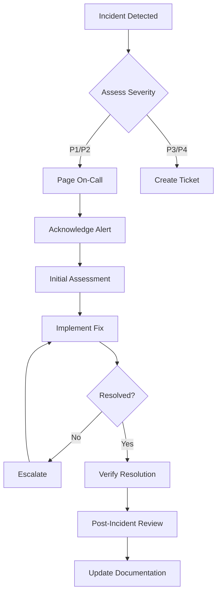

# Incident Response Guide

## Overview

This guide provides procedures for identifying, responding to, and resolving incidents in the Prism DNS infrastructure. Quick response and proper procedures minimize downtime and customer impact.

## Incident Classification

### Severity Levels

| Severity | Description | Response Time | Examples |
|----------|-------------|--------------|----------|
| **P1 - Critical** | Complete service outage or data loss | 15 minutes | API down, Database corruption, DNS failure |
| **P2 - Major** | Significant degradation affecting many users | 30 minutes | High latency, Partial outage, Auth failures |
| **P3 - Minor** | Limited impact, workaround available | 2 hours | Single feature broken, Slow queries |
| **P4 - Low** | Minimal impact, cosmetic issues | Next business day | UI glitches, Documentation errors |

## Incident Response Process



## On-Call Responsibilities

### Primary On-Call
- Acknowledge alerts within 15 minutes
- Perform initial triage
- Implement immediate fixes
- Escalate if needed
- Lead incident response
- Communicate status updates

### Secondary On-Call
- Available as backup
- Assist with complex issues
- Take over if primary unavailable
- Review post-incident report

## Incident Response Runbooks

### IR-001: Complete Service Outage

**Symptoms**: No response from API, all health checks failing

#### Immediate Actions (0-5 minutes)

1. **Acknowledge Alert**
   ```bash
   # Via PagerDuty app or
   pd-cli incident acknowledge <incident-id>
   ```

2. **Check Service Status**
   ```bash
   # SSH to production
   ssh ubuntu@35.170.180.10
   
   # Check all services
   cd ~/prism-deployment
   docker-compose ps
   
   # Check API
   curl -f http://localhost:8081/api/health || echo "API Down"
   ```

3. **Quick Restart Attempt**
   ```bash
   # Restart all services
   docker-compose restart
   
   # Wait 30 seconds
   sleep 30
   
   # Check again
   docker-compose ps
   ```

#### If Quick Fix Fails (5-15 minutes)

4. **Check Logs**
   ```bash
   # Recent logs
   docker-compose logs --tail=100 prism-server
   docker-compose logs --tail=100 postgres
   
   # System logs
   sudo journalctl -u docker -n 100
   dmesg | tail -50
   ```

5. **Check Resources**
   ```bash
   # Disk space
   df -h
   
   # Memory
   free -m
   
   # CPU
   top -bn1 | head -20
   
   # Docker resources
   docker system df
   ```

6. **Failover to Backup** (if available)
   ```bash
   # Update DNS to point to backup
   ./scripts/failover-to-backup.sh
   
   # Or update load balancer
   aws elb modify-load-balancer-attributes \
     --load-balancer-name prism-prod \
     --load-balancer-attributes "{\"ConnectionDraining\":{\"Enabled\":true}}"
   ```

#### Root Cause Analysis (15+ minutes)

7. **Detailed Investigation**
   ```bash
   # Check for recent deployments
   git log --oneline -10
   
   # Check system changes
   last -20
   history | tail -50
   
   # Review monitoring
   # Open Grafana dashboards
   # Check Prometheus alerts history
   ```

### IR-002: Database Issues

**Symptoms**: Timeouts, connection errors, slow queries

#### Immediate Actions

1. **Check Database Status**
   ```bash
   # Check PostgreSQL
   docker exec postgres pg_isready
   
   # Check connections
   docker exec postgres psql -U prism -c "SELECT count(*) FROM pg_stat_activity;"
   
   # Check locks
   docker exec postgres psql -U prism -c "
   SELECT pid, usename, pg_blocking_pids(pid) as blocked_by, query 
   FROM pg_stat_activity 
   WHERE pg_blocking_pids(pid)::text != '{}';
   "
   ```

2. **Kill Blocking Queries**
   ```sql
   -- Find blocking queries
   SELECT pg_terminate_backend(pid) 
   FROM pg_stat_activity 
   WHERE pid IN (SELECT unnest(pg_blocking_pids(pid)) FROM pg_stat_activity)
   AND query_start < now() - interval '5 minutes';
   ```

3. **Emergency Maintenance**
   ```bash
   # Restart with single user mode if needed
   docker-compose stop prism-server
   docker exec postgres psql -U prism -c "VACUUM ANALYZE;"
   docker-compose start prism-server
   ```

### IR-003: High Load / Performance Issues

**Symptoms**: Slow response times, timeouts, high CPU/memory

#### Immediate Actions

1. **Identify Bottleneck**
   ```bash
   # Top processes
   docker stats --no-stream
   
   # Network connections
   netstat -an | grep ESTABLISHED | wc -l
   
   # Check for attacks
   netstat -an | awk '{print $5}' | cut -d: -f1 | sort | uniq -c | sort -n | tail -20
   ```

2. **Enable Rate Limiting**
   ```bash
   # Emergency rate limit
   iptables -I INPUT -p tcp --dport 8080 -m state --state NEW -m recent --set
   iptables -I INPUT -p tcp --dport 8080 -m state --state NEW -m recent --update --seconds 1 --hitcount 10 -j DROP
   ```

3. **Scale Resources**
   ```bash
   # Add more workers
   docker-compose scale prism-server=3
   
   # Or increase resources
   docker update --cpus="2" --memory="2g" prism-server
   ```

### IR-004: Security Incident

**Symptoms**: Suspicious activity, unauthorized access, data breach

#### Immediate Actions

1. **Isolate System**
   ```bash
   # Block all non-essential traffic
   ufw default deny incoming
   ufw allow from <your-ip> to any port 22
   ufw reload
   ```

2. **Preserve Evidence**
   ```bash
   # Snapshot logs
   tar -czf incident-logs-$(date +%s).tar.gz /var/log /home/ubuntu/prism-deployment/logs
   
   # Dump network connections
   netstat -an > netstat-$(date +%s).txt
   ps auxf > processes-$(date +%s).txt
   ```

3. **Rotate Credentials**
   ```bash
   # Generate new secrets
   ./scripts/rotate-all-secrets.sh
   
   # Update API keys
   docker-compose down
   # Update .env file
   docker-compose up -d
   ```

### IR-005: DNS Service Failure

**Symptoms**: DNS queries failing, PowerDNS not responding

#### Immediate Actions

1. **Check PowerDNS**
   ```bash
   # Service status
   docker exec powerdns pdns_control ping
   
   # Query test
   dig @localhost -p 5353 test.managed.prism.local
   
   # API check
   curl -H "X-API-Key: $PDNS_API_KEY" http://localhost:8053/api/v1/servers/localhost
   ```

2. **Restart PowerDNS**
   ```bash
   docker-compose restart powerdns
   
   # Clear cache if needed
   docker exec powerdns pdns_control purge-cache "."
   ```

3. **Failover DNS**
   ```bash
   # Switch to backup DNS
   ./scripts/dns-failover.sh
   
   # Update NS records
   # Update registrar to point to backup nameservers
   ```

## Communication Templates

### Initial Response

```markdown
**Incident Alert** 🚨

- **Service**: Prism DNS
- **Severity**: P1
- **Impact**: API unavailable
- **Status**: Investigating
- **Started**: 14:32 UTC
- **Lead**: @oncall-engineer

We are aware of an issue affecting the Prism DNS API and are actively investigating.

Updates every 15 minutes or as status changes.
```

### Status Update

```markdown
**Incident Update** 📊

- **Time**: 14:45 UTC
- **Status**: Identified
- **Finding**: Database connection pool exhausted
- **Action**: Restarting services and increasing pool size
- **ETA**: 15 minutes

Current impact: API requests failing for ~30% of users
```

### Resolution Notice

```markdown
**Incident Resolved** ✅

- **Time**: 15:02 UTC
- **Duration**: 30 minutes
- **Root Cause**: Database connection leak in v1.2.3
- **Resolution**: Restarted services and rolled back to v1.2.2
- **Follow-up**: Post-incident review scheduled for tomorrow

Service has been fully restored. Thank you for your patience.
```

## Escalation Matrix

| Time Since Alert | P1 Action | P2 Action | P3/P4 Action |
|-----------------|-----------|-----------|--------------|
| 0-15 min | Primary on-call responds | Primary on-call responds | Ticket created |
| 15-30 min | Secondary joins | Assess priority | Work during hours |
| 30-60 min | Manager notified | Secondary available | - |
| 60+ min | VP Engineering notified | Manager notified | - |

### Contact List

```yaml
on_call:
  primary: "+1-555-0001"
  secondary: "+1-555-0002"
  
management:
  engineering_manager: "+1-555-0010"
  vp_engineering: "+1-555-0020"
  cto: "+1-555-0030"

external:
  aws_support: "https://console.aws.amazon.com/support"
  datadog: "support@datadoghq.com"
  pagerduty: "support@pagerduty.com"

stakeholders:
  customer_success: "cs-team@example.com"
  marketing: "marketing@example.com"
  legal: "legal@example.com"
```

## Post-Incident Review

### Timeline Template

```markdown
# Incident Post-Mortem: [Title]

## Incident Summary
- **Date**: YYYY-MM-DD
- **Duration**: X minutes
- **Severity**: PX
- **Customer Impact**: X% of users affected

## Timeline
- **14:32** - First alert triggered
- **14:33** - On-call acknowledged
- **14:35** - Initial investigation began
- **14:45** - Root cause identified
- **14:50** - Fix implemented
- **15:02** - Service restored
- **15:15** - All-clear given

## Root Cause
[Detailed explanation of what caused the incident]

## Resolution
[Steps taken to resolve the incident]

## Lessons Learned
1. What went well
2. What could be improved
3. Action items

## Action Items
- [ ] Fix root cause (Owner, Due date)
- [ ] Improve monitoring (Owner, Due date)
- [ ] Update runbook (Owner, Due date)
```

### Review Meeting Agenda

1. **Timeline Review** (10 min)
   - Walk through incident timeline
   - Identify decision points

2. **Technical Deep Dive** (20 min)
   - Root cause analysis
   - Why wasn't it caught earlier?
   - Technical debt involved?

3. **Process Review** (15 min)
   - Communication effectiveness
   - Tool performance
   - Escalation appropriateness

4. **Action Planning** (15 min)
   - Preventive measures
   - Process improvements
   - Assign owners and dates

## Incident Metrics

### Key Metrics to Track

```sql
-- Monthly incident metrics
SELECT 
  DATE_TRUNC('month', created_at) as month,
  severity,
  COUNT(*) as incident_count,
  AVG(time_to_acknowledge) as avg_tta,
  AVG(time_to_resolve) as avg_ttr,
  SUM(customer_minutes_affected) as total_impact
FROM incidents
GROUP BY month, severity
ORDER BY month DESC;
```

### SLA Targets

| Metric | P1 Target | P2 Target | P3 Target |
|--------|-----------|-----------|-----------|
| Time to Acknowledge | 15 min | 30 min | 2 hours |
| Time to Resolve | 2 hours | 4 hours | 24 hours |
| Customer Communication | 30 min | 1 hour | 4 hours |
| Post-Incident Review | 48 hours | 1 week | 2 weeks |

## Disaster Recovery

### Backup Restoration

```bash
#!/bin/bash
# restore-from-backup.sh

# 1. Stop services
docker-compose stop

# 2. Restore database
aws s3 cp s3://prism-backups/postgres/latest.sql.gz .
gunzip latest.sql.gz
docker exec -i postgres psql -U prism prism < latest.sql

# 3. Restore configurations
aws s3 cp s3://prism-backups/config/latest.tar.gz .
tar -xzf latest.tar.gz -C /home/ubuntu/prism-deployment

# 4. Start services
docker-compose up -d

# 5. Verify
./scripts/health-check.sh
```

### Regional Failover

```bash
# Failover to DR region
./scripts/regional-failover.sh us-west-2

# Update DNS
aws route53 change-resource-record-sets \
  --hosted-zone-id Z123456 \
  --change-batch file://failover-dns.json
```

## Preventive Measures

### Regular Drills

- **Monthly**: Restart drills
- **Quarterly**: Failover drills  
- **Annually**: Full DR test

### Monitoring Improvements

```yaml
# Additional alerts to prevent incidents
- alert: ConnectionPoolNearLimit
  expr: db_connections_active / db_connections_max > 0.8
  annotations:
    summary: "Database connection pool at 80%"
    
- alert: DiskSpacePrediction
  expr: predict_linear(disk_free_bytes[4h], 24*3600) < 0
  annotations:
    summary: "Disk will be full in 24 hours"
```

---

*Remember: Stay calm, follow the runbook, and communicate clearly. Every incident is a learning opportunity.*