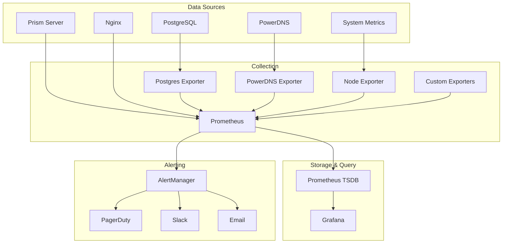

# Monitoring Guide

## Overview

This guide covers the monitoring infrastructure for Prism DNS, including metrics collection, dashboards, alerting, and troubleshooting.

## Monitoring Stack Architecture



## Prometheus Configuration

### 1. Main Configuration

```yaml
# prometheus/prometheus.yml
global:
  scrape_interval: 15s
  evaluation_interval: 15s
  external_labels:
    environment: 'production'
    region: 'us-east-1'

# Alertmanager configuration
alerting:
  alertmanagers:
    - static_configs:
        - targets:
            - alertmanager:9093

# Load rules
rule_files:
  - "alerts/*.yml"

# Scrape configurations
scrape_configs:
  # Prometheus self-monitoring
  - job_name: 'prometheus'
    static_configs:
      - targets: ['localhost:9090']

  # Node Exporter
  - job_name: 'node'
    static_configs:
      - targets: ['node-exporter:9100']

  # Prism Application
  - job_name: 'prism'
    static_configs:
      - targets: ['prism-server:8081']
    metrics_path: '/metrics'

  # Nginx
  - job_name: 'nginx'
    static_configs:
      - targets: ['nginx-exporter:9113']

  # PostgreSQL
  - job_name: 'postgres'
    static_configs:
      - targets: ['postgres-exporter:9187']

  # PowerDNS
  - job_name: 'powerdns'
    static_configs:
      - targets: ['powerdns-exporter:9120']

  # Docker
  - job_name: 'docker'
    static_configs:
      - targets: ['docker-host:9323']
```

### 2. Recording Rules

```yaml
# prometheus/rules/recording.yml
groups:
  - name: prism_aggregations
    interval: 30s
    rules:
      # Request rate
      - record: prism:request_rate_5m
        expr: rate(prism_http_requests_total[5m])
      
      # Error rate
      - record: prism:error_rate_5m
        expr: rate(prism_http_requests_total{status=~"5.."}[5m])
      
      # Success rate
      - record: prism:success_rate_5m
        expr: |
          (
            sum(rate(prism_http_requests_total{status=~"2.."}[5m]))
            /
            sum(rate(prism_http_requests_total[5m]))
          )
      
      # P95 latency
      - record: prism:latency_p95_5m
        expr: histogram_quantile(0.95, rate(prism_http_request_duration_seconds_bucket[5m]))
      
      # Active hosts
      - record: prism:active_hosts
        expr: prism_registered_hosts_total - prism_offline_hosts_total
      
      # DNS query rate
      - record: dns:query_rate_5m
        expr: rate(powerdns_queries_total[5m])
```

## Alert Configuration

### 1. Application Alerts

```yaml
# prometheus/alerts/application.yml
groups:
  - name: prism_application
    rules:
      - alert: HighErrorRate
        expr: prism:error_rate_5m > 0.05
        for: 5m
        labels:
          severity: warning
          team: backend
        annotations:
          summary: "High error rate detected"
          description: "Error rate is {{ $value | humanizePercentage }} for 5 minutes"
          runbook: "https://wiki.example.com/runbooks/high-error-rate"
      
      - alert: HighLatency
        expr: prism:latency_p95_5m > 1
        for: 10m
        labels:
          severity: warning
          team: backend
        annotations:
          summary: "High API latency"
          description: "P95 latency is {{ $value }}s"
      
      - alert: ServiceDown
        expr: up{job="prism"} == 0
        for: 2m
        labels:
          severity: critical
          team: backend
        annotations:
          summary: "Prism service is down"
          description: "Prism service has been down for 2 minutes"
          action: "Check service logs and restart if necessary"
```

### 2. Infrastructure Alerts

```yaml
# prometheus/alerts/infrastructure.yml
groups:
  - name: infrastructure
    rules:
      - alert: HighCPUUsage
        expr: |
          100 - (avg by (instance) (irate(node_cpu_seconds_total{mode="idle"}[5m])) * 100) > 80
        for: 10m
        labels:
          severity: warning
          team: infrastructure
        annotations:
          summary: "High CPU usage on {{ $labels.instance }}"
          description: "CPU usage is {{ $value }}%"
      
      - alert: HighMemoryUsage
        expr: |
          (1 - (node_memory_MemAvailable_bytes / node_memory_MemTotal_bytes)) * 100 > 85
        for: 10m
        labels:
          severity: warning
          team: infrastructure
        annotations:
          summary: "High memory usage on {{ $labels.instance }}"
          description: "Memory usage is {{ $value }}%"
      
      - alert: DiskSpaceLow
        expr: |
          (node_filesystem_avail_bytes{mountpoint="/"} / node_filesystem_size_bytes{mountpoint="/"}) * 100 < 15
        for: 5m
        labels:
          severity: critical
          team: infrastructure
        annotations:
          summary: "Low disk space on {{ $labels.instance }}"
          description: "Only {{ $value }}% disk space remaining"
      
      - alert: DatabaseConnectionPoolExhausted
        expr: prism_database_connections_active >= prism_database_connections_max * 0.9
        for: 5m
        labels:
          severity: warning
          team: backend
        annotations:
          summary: "Database connection pool near exhaustion"
          description: "{{ $value }} of {{ $labels.max }} connections in use"
```

### 3. DNS-Specific Alerts

```yaml
# prometheus/alerts/dns.yml
groups:
  - name: dns
    rules:
      - alert: DNSQueryFailureRate
        expr: |
          rate(powerdns_queries_total{result="failure"}[5m]) 
          / 
          rate(powerdns_queries_total[5m]) > 0.01
        for: 5m
        labels:
          severity: warning
          team: dns
        annotations:
          summary: "High DNS query failure rate"
          description: "{{ $value | humanizePercentage }} of DNS queries failing"
      
      - alert: DNSLatencyHigh
        expr: dns_query_duration_seconds{quantile="0.95"} > 0.1
        for: 10m
        labels:
          severity: warning
          team: dns
        annotations:
          summary: "High DNS query latency"
          description: "P95 DNS latency is {{ $value }}s"
      
      - alert: DNSZoneTransferFailure
        expr: increase(powerdns_zone_transfer_failures_total[1h]) > 0
        labels:
          severity: critical
          team: dns
        annotations:
          summary: "DNS zone transfer failed"
          description: "Zone transfer failures detected for {{ $labels.zone }}"
```

## Grafana Dashboards

### 1. Main Application Dashboard

```json
{
  "dashboard": {
    "title": "Prism DNS Overview",
    "panels": [
      {
        "title": "Request Rate",
        "targets": [
          {
            "expr": "sum(rate(prism_http_requests_total[5m])) by (method)"
          }
        ],
        "type": "graph",
        "gridPos": {"h": 8, "w": 12, "x": 0, "y": 0}
      },
      {
        "title": "Error Rate",
        "targets": [
          {
            "expr": "sum(rate(prism_http_requests_total{status=~'5..'}[5m]))"
          }
        ],
        "type": "graph",
        "gridPos": {"h": 8, "w": 12, "x": 12, "y": 0}
      },
      {
        "title": "Response Time (P50, P95, P99)",
        "targets": [
          {
            "expr": "histogram_quantile(0.50, sum(rate(prism_http_request_duration_seconds_bucket[5m])) by (le))",
            "legendFormat": "P50"
          },
          {
            "expr": "histogram_quantile(0.95, sum(rate(prism_http_request_duration_seconds_bucket[5m])) by (le))",
            "legendFormat": "P95"
          },
          {
            "expr": "histogram_quantile(0.99, sum(rate(prism_http_request_duration_seconds_bucket[5m])) by (le))",
            "legendFormat": "P99"
          }
        ],
        "type": "graph",
        "gridPos": {"h": 8, "w": 12, "x": 0, "y": 8}
      },
      {
        "title": "Active Hosts",
        "targets": [
          {
            "expr": "prism_registered_hosts_total - prism_offline_hosts_total"
          }
        ],
        "type": "stat",
        "gridPos": {"h": 8, "w": 12, "x": 12, "y": 8}
      }
    ]
  }
}
```

### 2. Infrastructure Dashboard

Key metrics to display:
- CPU usage by container
- Memory usage by container
- Disk I/O rates
- Network traffic
- Container restart count
- System load average

### 3. DNS Operations Dashboard

Key metrics:
- Query rate by type (A, AAAA, etc.)
- Query response time distribution
- Cache hit rate
- Zone transfer status
- DNSSEC validation rate
- Top queried domains

## AlertManager Configuration

### 1. Main Configuration

```yaml
# alertmanager/alertmanager.yml
global:
  resolve_timeout: 5m
  slack_api_url: ${SLACK_WEBHOOK_URL}
  pagerduty_url: https://events.pagerduty.com/v2/enqueue

# Route tree
route:
  group_by: ['alertname', 'cluster', 'service']
  group_wait: 10s
  group_interval: 10s
  repeat_interval: 12h
  receiver: 'default'
  
  routes:
    # Critical alerts to PagerDuty
    - match:
        severity: critical
      receiver: pagerduty
      continue: true
    
    # All alerts to Slack
    - match_re:
        severity: critical|warning
      receiver: slack
      continue: true
    
    # Database alerts to DBA team
    - match:
        team: database
      receiver: dba-team
    
    # DNS alerts to DNS team
    - match:
        team: dns
      receiver: dns-team

# Receivers
receivers:
  - name: 'default'
    webhook_configs:
      - url: 'http://alertmanager-webhook:5001/'

  - name: 'pagerduty'
    pagerduty_configs:
      - routing_key: ${PAGERDUTY_ROUTING_KEY}
        description: '{{ range .Alerts }}{{ .Annotations.summary }}{{ end }}'

  - name: 'slack'
    slack_configs:
      - channel: '#alerts'
        title: 'Alert: {{ .GroupLabels.alertname }}'
        text: '{{ range .Alerts }}{{ .Annotations.description }}{{ end }}'

  - name: 'dba-team'
    email_configs:
      - to: 'dba-team@example.com'
        
  - name: 'dns-team'
    email_configs:
      - to: 'dns-team@example.com'

# Inhibition rules
inhibit_rules:
  - source_match:
      severity: 'critical'
    target_match:
      severity: 'warning'
    equal: ['alertname', 'instance']
```

### 2. Alert Templates

```yaml
# alertmanager/templates/slack.tmpl
{{ define "slack.default.title" }}
[{{ .Status | toUpper }}{{ if eq .Status "firing" }}:{{ .Alerts.Firing | len }}{{ end }}] {{ .GroupLabels.alertname }}
{{ end }}

{{ define "slack.default.text" }}
{{ range .Alerts }}
*Alert:* {{ .Annotations.summary }}
*Description:* {{ .Annotations.description }}
*Severity:* {{ .Labels.severity }}
*Instance:* {{ .Labels.instance }}
*Runbook:* {{ .Annotations.runbook }}
{{ end }}
{{ end }}
```

## Monitoring Procedures

### 1. Daily Health Check

```bash
#!/bin/bash
# daily-health-check.sh

echo "🏥 Daily Monitoring Health Check"
echo "================================"

# Check Prometheus targets
echo -n "Prometheus targets: "
curl -s http://localhost:9090/api/v1/targets | jq '.data.activeTargets | length'

# Check for firing alerts
echo -n "Active alerts: "
curl -s http://localhost:9090/api/v1/alerts | jq '.data.alerts | map(select(.state=="firing")) | length'

# Check Grafana
echo -n "Grafana status: "
curl -s http://localhost:3000/api/health | jq '.database'

# Check metrics ingestion rate
echo -n "Metrics/sec: "
curl -s http://localhost:9090/api/v1/query?query=prometheus_tsdb_head_samples_appended_total | \
  jq '.data.result[0].value[1]' | xargs -I {} echo "scale=2; {}/60" | bc
```

### 2. Dashboard Review Checklist

Daily review:
- [ ] Check error rate trends
- [ ] Review response time percentiles
- [ ] Verify all services are up
- [ ] Check disk space trends
- [ ] Review top API endpoints

Weekly review:
- [ ] Analyze traffic patterns
- [ ] Review capacity trends
- [ ] Check backup success rate
- [ ] Verify certificate expiration
- [ ] Review security alerts

### 3. Alert Response Procedures

```markdown
## Alert Response SOP

### 1. Acknowledge Alert
- Respond within SLA time
- Acknowledge in PagerDuty/AlertManager
- Post in #incidents channel

### 2. Initial Assessment
- Check dashboard for context
- Review recent changes
- Assess customer impact

### 3. Mitigation
- Follow runbook if available
- Implement immediate fix
- Escalate if needed

### 4. Resolution
- Verify fix is working
- Monitor for recurrence
- Update incident ticket

### 5. Post-Incident
- Create post-mortem if needed
- Update runbook
- Share learnings
```

## Custom Metrics

### 1. Application Metrics

```python
# server/metrics.py
from prometheus_client import Counter, Histogram, Gauge, Info

# Request metrics
request_count = Counter(
    'prism_http_requests_total',
    'Total HTTP requests',
    ['method', 'endpoint', 'status']
)

request_duration = Histogram(
    'prism_http_request_duration_seconds',
    'HTTP request duration',
    ['method', 'endpoint'],
    buckets=[0.01, 0.025, 0.05, 0.1, 0.25, 0.5, 1.0, 2.5, 5.0]
)

# Business metrics
registered_hosts = Gauge(
    'prism_registered_hosts_total',
    'Total registered hosts'
)

active_connections = Gauge(
    'prism_active_connections',
    'Active TCP connections'
)

# DNS metrics
dns_operations = Counter(
    'prism_dns_operations_total',
    'DNS operations',
    ['operation', 'status']
)

dns_sync_lag = Histogram(
    'prism_dns_sync_lag_seconds',
    'Time between registration and DNS update'
)

# Info metrics
build_info = Info(
    'prism_build_info',
    'Build information'
)
build_info.info({
    'version': VERSION,
    'commit': GIT_COMMIT,
    'build_date': BUILD_DATE
})
```

### 2. Metric Collection Middleware

```python
# server/middleware/metrics.py
import time
from functools import wraps

def track_request_metrics(func):
    @wraps(func)
    async def wrapper(request, *args, **kwargs):
        start_time = time.time()
        
        try:
            response = await func(request, *args, **kwargs)
            status = response.status
        except Exception as e:
            status = 500
            raise
        finally:
            duration = time.time() - start_time
            
            # Record metrics
            request_count.labels(
                method=request.method,
                endpoint=request.path,
                status=status
            ).inc()
            
            request_duration.labels(
                method=request.method,
                endpoint=request.path
            ).observe(duration)
        
        return response
    
    return wrapper
```

## Log Aggregation

### 1. Fluentd Configuration

```yaml
# fluentd/fluent.conf
<source>
  @type forward
  port 24224
  bind 0.0.0.0
</source>

# Parse Docker logs
<filter docker.**>
  @type parser
  key_name log
  reserve_data true
  <parse>
    @type json
  </parse>
</filter>

# Add metadata
<filter **>
  @type record_transformer
  <record>
    hostname ${hostname}
    environment production
    timestamp ${time}
  </record>
</filter>

# Output to Elasticsearch
<match **>
  @type elasticsearch
  host elasticsearch
  port 9200
  logstash_format true
  logstash_prefix prism
  <buffer>
    @type file
    path /var/log/fluentd-buffers/elasticsearch.buffer
    flush_mode interval
    flush_interval 10s
  </buffer>
</match>
```

### 2. Log Queries

Useful queries for troubleshooting:

```json
// Find errors in last hour
{
  "query": {
    "bool": {
      "must": [
        {"range": {"@timestamp": {"gte": "now-1h"}}},
        {"match": {"level": "error"}}
      ]
    }
  }
}

// Find slow requests
{
  "query": {
    "bool": {
      "must": [
        {"range": {"duration": {"gte": 1000}}},
        {"match": {"type": "http_request"}}
      ]
    }
  }
}

// Find specific user activity
{
  "query": {
    "bool": {
      "must": [
        {"match": {"user_id": "user123"}},
        {"range": {"@timestamp": {"gte": "now-24h"}}}
      ]
    }
  }
}
```

## Synthetic Monitoring

### 1. Blackbox Exporter Configuration

```yaml
# blackbox/blackbox.yml
modules:
  http_2xx:
    prober: http
    timeout: 5s
    http:
      valid_http_versions: ["HTTP/1.1", "HTTP/2"]
      valid_status_codes: [200]
      method: GET
      preferred_ip_protocol: "ip4"
      ip_protocol_fallback: false

  tcp_connect:
    prober: tcp
    timeout: 5s

  dns_test:
    prober: dns
    timeout: 5s
    dns:
      query_name: "test.managed.prism.local"
      query_type: "A"
      valid_rcodes:
        - NOERROR

# Prometheus scrape config
scrape_configs:
  - job_name: 'blackbox'
    metrics_path: /probe
    params:
      module: [http_2xx]
    static_configs:
      - targets:
        - https://prism.thepaynes.ca/api/health
        - https://prism.thepaynes.ca/
    relabel_configs:
      - source_labels: [__address__]
        target_label: __param_target
      - source_labels: [__param_target]
        target_label: instance
      - target_label: __address__
        replacement: blackbox-exporter:9115
```

### 2. Synthetic Tests

```python
# monitoring/synthetic_tests.py
import asyncio
import aiohttp
from prometheus_client import Histogram, Counter

synthetic_test_duration = Histogram(
    'synthetic_test_duration_seconds',
    'Synthetic test duration',
    ['test_name', 'endpoint']
)

synthetic_test_status = Counter(
    'synthetic_test_status_total',
    'Synthetic test results',
    ['test_name', 'status']
)

async def test_user_journey():
    """Test complete user registration flow."""
    async with aiohttp.ClientSession() as session:
        # 1. Check health
        start = time.time()
        async with session.get('https://prism.thepaynes.ca/api/health') as resp:
            assert resp.status == 200
        
        # 2. Simulate registration
        # ... registration test ...
        
        duration = time.time() - start
        synthetic_test_duration.labels(
            test_name='user_journey',
            endpoint='full_flow'
        ).observe(duration)
        
        synthetic_test_status.labels(
            test_name='user_journey',
            status='success'
        ).inc()

# Run tests periodically
async def run_synthetic_monitoring():
    while True:
        try:
            await test_user_journey()
        except Exception as e:
            synthetic_test_status.labels(
                test_name='user_journey',
                status='failure'
            ).inc()
            logger.error(f"Synthetic test failed: {e}")
        
        await asyncio.sleep(300)  # Every 5 minutes
```

## Capacity Planning

### 1. Trend Analysis Queries

```promql
# Predict disk usage in 7 days
predict_linear(node_filesystem_avail_bytes[4h], 7*24*60*60) < 0

# Growth rate of registered hosts
deriv(prism_registered_hosts_total[7d])

# Request rate trend
predict_linear(rate(prism_http_requests_total[1h])[4h:], 7*24*60*60)
```

### 2. Capacity Reports

Monthly capacity review template:
```markdown
# Capacity Report - Month YYYY-MM

## Current Usage
- CPU: Average X%, Peak Y%
- Memory: Average X GB, Peak Y GB
- Storage: X GB used, Y% growth
- Network: Average X Mbps, Peak Y Mbps

## Growth Trends
- Host registrations: +X% MoM
- API requests: +X% MoM
- Storage growth: X GB/month

## Projections
- CPU capacity reached in: X months
- Memory capacity reached in: X months
- Storage capacity reached in: X months

## Recommendations
- [ ] Scale up instance type
- [ ] Add read replicas
- [ ] Implement data archival
```

---

*Monitoring is not just about collecting metrics, it's about understanding your system's behavior and being proactive about issues.*