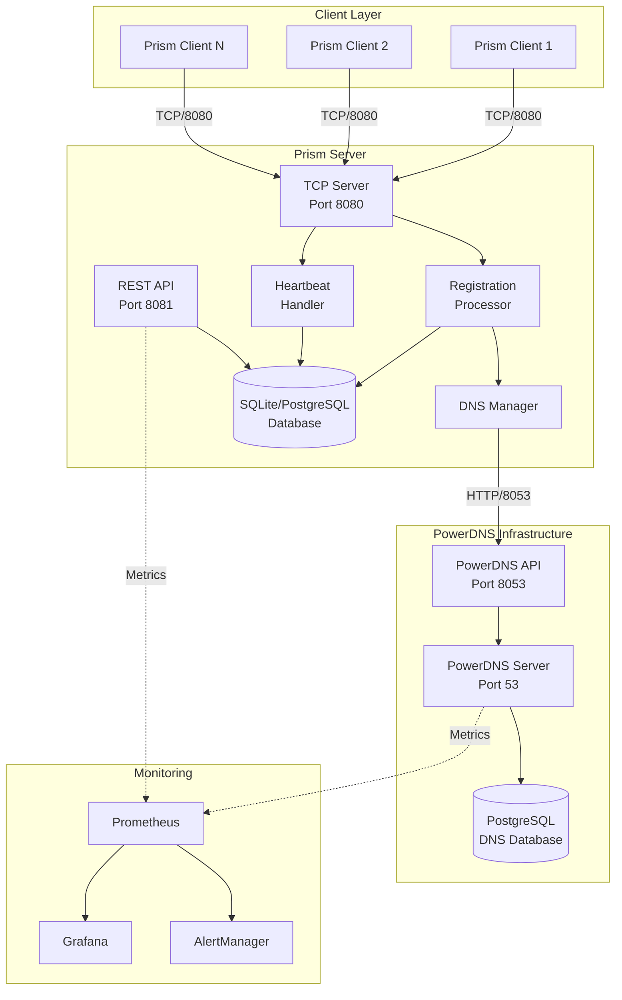
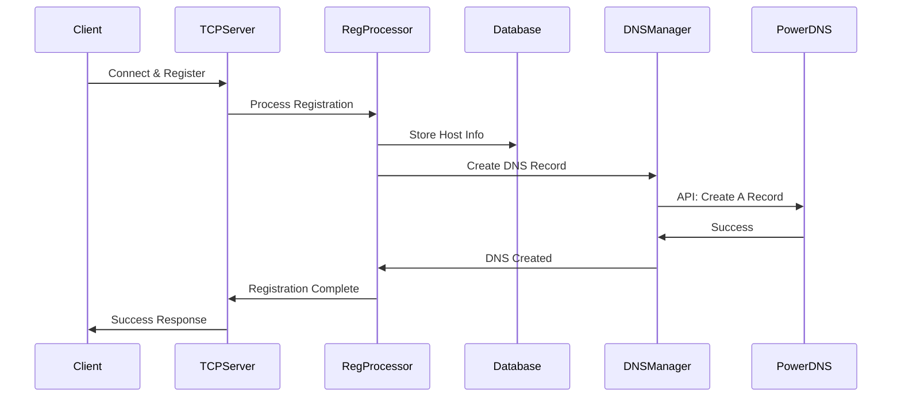
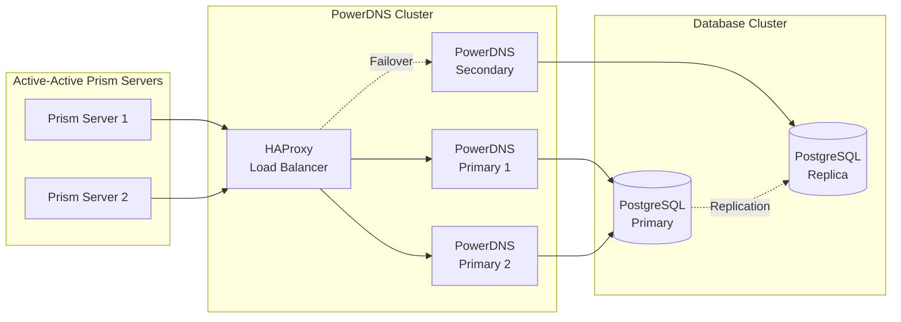
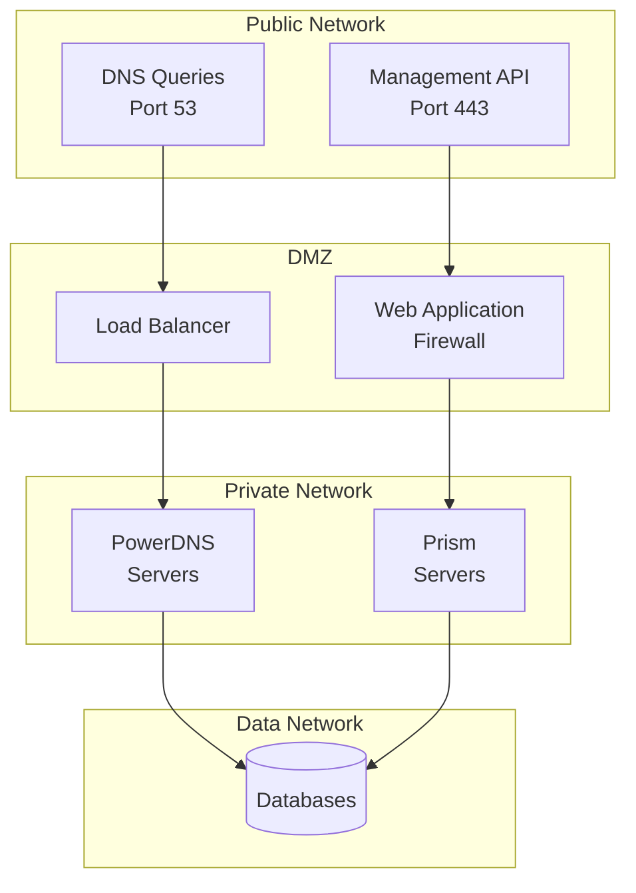

# PowerDNS Architecture Overview

## System Architecture

The PowerDNS integration with Prism DNS creates a comprehensive managed DNS solution that automatically maintains DNS records for registered hosts.



## Component Interactions

### 1. Client Registration Flow



### 2. DNS Synchronization

The system maintains consistency between the host registry and DNS records through:

- **Immediate Sync**: DNS records created/updated during registration
- **Async Queue**: Background processing for bulk operations
- **Reconciliation**: Periodic checks for consistency
- **Audit Trail**: All DNS operations logged

### 3. High Availability Design



## Data Flow

### 1. Write Path (Record Creation)

1. Client registers with Prism server
2. Registration processor validates request
3. Host record created in Prism database
4. DNS Manager called asynchronously
5. PowerDNS API request to create record
6. Record stored in PowerDNS database
7. DNS caches updated
8. Success returned to client

### 2. Read Path (DNS Resolution)

1. DNS query arrives at PowerDNS
2. Cache checked for record
3. If not cached, database queried
4. Record returned to resolver
5. Response cached per TTL
6. Answer sent to client

### 3. Update Path (IP Changes)

1. Client re-registers with new IP
2. Prism detects IP change
3. Database updated with new IP
4. DNS Manager updates PowerDNS
5. PowerDNS increments serial
6. NOTIFY sent to secondaries
7. Caches purged for record

## Security Architecture

### Network Segmentation



### Authentication & Authorization

- **API Authentication**: Key-based authentication for PowerDNS API
- **Client Authentication**: Optional TLS client certificates
- **Role-Based Access**: Granular permissions for operations
- **Audit Logging**: All administrative actions logged

## Scalability Considerations

### Horizontal Scaling

- **Prism Servers**: Stateless, scale behind load balancer
- **PowerDNS**: Multiple authoritative servers
- **Database**: Read replicas for query distribution
- **Caching**: Redis/Memcached for session state

### Performance Optimization

1. **Connection Pooling**: Reuse PowerDNS API connections
2. **Batch Operations**: Group multiple DNS updates
3. **Async Processing**: Non-blocking DNS operations
4. **Cache Strategies**: Multi-layer caching approach

### Capacity Planning

| Component | Metric | Recommendation |
|-----------|--------|----------------|
| Prism Server | Connections | 10K per instance |
| PowerDNS | Queries/sec | 50K per instance |
| Database | Records | 10M per instance |
| API Calls | Requests/sec | 1K per instance |

## Deployment Patterns

### 1. Single Region

- Simple deployment
- Low latency within region
- Cost-effective
- Suitable for regional services

### 2. Multi-Region Active-Active

- Global load distribution
- Geo-DNS routing
- Cross-region replication
- High availability

### 3. Edge Deployment

- PowerDNS at edge locations
- Central management plane
- Local resolution
- Reduced latency

## Integration Points

### 1. Monitoring Integration

- Prometheus metrics exported
- Grafana dashboards
- Custom alerts
- SLA tracking

### 2. ITSM Integration

- Incident automation
- Change tracking
- Configuration management
- Compliance reporting

### 3. External Systems

- IPAM synchronization
- CMDB updates
- Certificate management
- Load balancer updates

## Technology Stack

### Core Components

- **Language**: Python 3.8+
- **Framework**: AsyncIO, FastAPI
- **Database**: PostgreSQL 12+
- **DNS Server**: PowerDNS 4.8+
- **Container**: Docker 20+
- **Orchestration**: Docker Compose / Kubernetes

### Libraries & Dependencies

```python
# Key Python dependencies
aiohttp>=3.8.0      # Async HTTP client
asyncpg>=0.27.0     # PostgreSQL async driver
prometheus-client>=0.16.0  # Metrics
structlog>=23.0.0   # Structured logging
pydantic>=2.0.0     # Data validation
```

## Future Architecture Considerations

### Planned Enhancements

1. **DNSSEC Support**: Automatic signing of zones
2. **GeoDNS**: Location-based responses
3. **DNS over HTTPS**: DoH endpoint
4. **API Gateway**: Centralized API management
5. **Service Mesh**: Istio/Linkerd integration

### Scaling Roadmap

- Phase 1: Current - 100K hosts
- Phase 2: Sharding - 1M hosts  
- Phase 3: Global distribution - 10M hosts
- Phase 4: Edge computing - 100M hosts