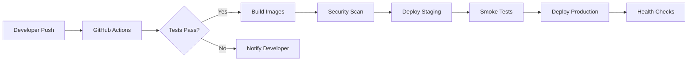

# CI/CD Pipeline Overview - Training Presentation

## Slide Deck Outline

### Slide 1: Title
**Prism DNS CI/CD Pipeline**
- Automated Deployment to Production
- Version 1.0
- [Your Name] | [Date]

### Slide 2: Agenda
1. CI/CD Concepts & Benefits
2. Our Pipeline Architecture
3. GitHub Actions Deep Dive
4. Deployment Process
5. Monitoring & Rollback
6. Best Practices
7. Hands-On Demo
8. Q&A

### Slide 3: What is CI/CD?

**Continuous Integration (CI)**
- Automated building and testing
- Early bug detection
- Consistent code quality

**Continuous Deployment (CD)**
- Automated deployment to production
- Reduced manual errors
- Faster time to market

### Slide 4: Why CI/CD Matters

| Traditional | CI/CD |
|------------|-------|
| Manual testing | Automated tests |
| Deployment scripts | Pipeline as code |
| Long release cycles | Frequent releases |
| High risk deploys | Incremental changes |
| Slow feedback | Instant feedback |

### Slide 5: Our Pipeline Architecture



### Slide 6: Pipeline Stages

1. **Source** - Code repository
2. **Build** - Compile and package
3. **Test** - Unit, integration, security
4. **Deploy** - Environment deployment
5. **Monitor** - Health and metrics

### Slide 7: GitHub Actions Components

**Workflow**
```yaml
name: Deploy to Production
on:
  push:
    branches: [main]
```

**Jobs**
```yaml
jobs:
  build:
    runs-on: ubuntu-latest
  test:
    needs: build
  deploy:
    needs: test
```

**Steps**
```yaml
steps:
  - uses: actions/checkout@v4
  - name: Build application
    run: docker build .
```

### Slide 8: Our Deployment Workflow

```yaml
name: Deploy to EC2
on:
  push:
    branches: [main]
  workflow_dispatch:

jobs:
  deploy:
    runs-on: ubuntu-latest
    steps:
      - name: Checkout code
        uses: actions/checkout@v4
      
      - name: Build and test
        run: |
          docker-compose build
          docker-compose run tests
      
      - name: Deploy to EC2
        uses: appleboy/ssh-action@v1.0.0
        with:
          host: ${{ secrets.EC2_HOST }}
          username: ubuntu
          key: ${{ secrets.EC2_SSH_KEY }}
          script: |
            cd ~/prism-deployment
            docker-compose pull
            docker-compose up -d
```

### Slide 9: Environment Strategy

| Environment | Trigger | Approval | Purpose |
|------------|---------|----------|---------|
| Development | PR | Auto | Testing |
| Staging | main push | Auto | Integration |
| Production | Manual | Required | Live service |

### Slide 10: Security in CI/CD

**Secret Management**
- GitHub Secrets for credentials
- Environment-specific configs
- Automatic rotation

**Scanning**
- Container vulnerability scan
- Dependency checks
- SAST/DAST integration

### Slide 11: Deployment Process

1. **Developer commits code**
   ```bash
   git add .
   git commit -m "feat: new feature"
   git push origin main
   ```

2. **GitHub Actions triggered**
   - Builds Docker images
   - Runs test suite
   - Scans for vulnerabilities

3. **Deployment execution**
   - SSH to EC2
   - Pull new images
   - Rolling update

### Slide 12: Live Demo Script

```bash
# Make a change
echo "# New feature" >> README.md
git add README.md
git commit -m "docs: add new feature"
git push origin main

# Watch GitHub Actions
# Show running workflow
# Show deployment logs
# Verify deployment
```

### Slide 13: Monitoring Integration

**Metrics Collection**
- Build success rate
- Deployment frequency
- Lead time for changes
- Mean time to recovery

**Dashboards**
- GitHub Actions insights
- Grafana deployment metrics
- Application health status

### Slide 14: Rollback Procedures

**Automatic Rollback**
```yaml
- name: Health Check
  run: |
    if ! curl -f https://app.example.com/health; then
      echo "Health check failed, rolling back"
      ./scripts/rollback.sh
    fi
```

**Manual Rollback**
```bash
# List deployments
./scripts/list-deployments.sh

# Rollback to previous
./scripts/rollback.sh v1.2.3
```

### Slide 15: Best Practices

1. **Keep builds fast** (<10 minutes)
2. **Test in parallel** when possible
3. **Use caching** for dependencies
4. **Fail fast** on errors
5. **Monitor everything**
6. **Document runbooks**

### Slide 16: Common Pitfalls

❌ **Avoid These:**
- Hardcoded secrets
- Skipping tests for speed
- Large, infrequent deploys
- No rollback plan
- Ignoring alerts

✅ **Do These Instead:**
- Use secret management
- Comprehensive test suite
- Small, frequent deploys
- Automated rollbacks
- Alert response SLAs

### Slide 17: Hands-On Exercise

**Exercise: Deploy a Change**

1. Fork the repository
2. Make a small change
3. Create pull request
4. Watch CI checks
5. Merge and deploy
6. Verify deployment

Time: 15 minutes

### Slide 18: Advanced Topics

**Coming in Advanced Training:**
- Blue-green deployments
- Canary releases
- Feature flags
- Multi-region deployment
- GitOps with ArgoCD

### Slide 19: Resources

**Documentation**
- [CI/CD Guide](/docs/ci-cd/overview.md)
- [GitHub Actions Docs](https://docs.github.com/actions)
- [Deployment Runbook](/docs/operations/deployment.md)

**Support**
- Slack: #ci-cd-help
- Wiki: wiki.company.com/ci-cd
- Office Hours: Thursdays 2pm

### Slide 20: Key Takeaways

1. **Automation reduces errors**
2. **Fast feedback improves quality**
3. **Small changes reduce risk**
4. **Monitoring enables confidence**
5. **Practice makes perfect**

### Slide 21: Q&A

**Common Questions:**
- How do we handle database migrations?
- What about configuration changes?
- How to debug failed deployments?
- Can we deploy during business hours?
- What's our rollback SLA?

## Speaker Notes

### Slide 3 Notes
- Emphasize cultural shift, not just tools
- Share personal experience with manual deployments
- Highlight time savings (hours → minutes)

### Slide 7 Notes
- Show actual GitHub UI during presentation
- Walk through a real workflow file
- Explain YAML syntax basics

### Slide 11 Notes
- Live demo if possible
- Have backup screenshots ready
- Show actual deployment logs

### Slide 14 Notes
- Emphasize importance of rollback testing
- Share rollback success stories
- Discuss rollback vs. fix-forward

### Demo Preparation

```bash
# Pre-demo checklist
- [ ] Test environment ready
- [ ] Demo branch prepared
- [ ] Backup slides ready
- [ ] Network connectivity verified
- [ ] Credentials working
```

### Time Management
- Introduction: 5 minutes
- Core content: 30 minutes
- Demo: 10 minutes
- Q&A: 15 minutes
- Total: 60 minutes

## Interactive Elements

### Poll Questions
1. Who has used CI/CD before?
2. What's your biggest deployment pain point?
3. How often does your team deploy?

### Discussion Topics
1. Share deployment horror stories
2. Brainstorm automation opportunities
3. Identify team-specific challenges

### Hands-On Checkpoints
- [ ] Everyone can access GitHub
- [ ] Everyone can see Actions tab
- [ ] Everyone understands workflow syntax
- [ ] Everyone completed exercise

## Post-Training

### Follow-Up Email Template
```
Subject: CI/CD Training Follow-Up

Thanks for attending the CI/CD training! Here are your next steps:

1. Complete hands-on exercise (if not done)
2. Review documentation links
3. Join #ci-cd-help Slack channel
4. Schedule 1:1 if you have questions

Resources:
- Slides: [link]
- Recording: [link]
- Documentation: [link]

Let me know how I can help you succeed!
```

### Success Metrics
- Training attendance rate
- Exercise completion rate
- Post-training survey scores
- CI/CD adoption rate
- Deployment frequency increase

---

*Remember: Keep it interactive, use real examples, and encourage questions!*